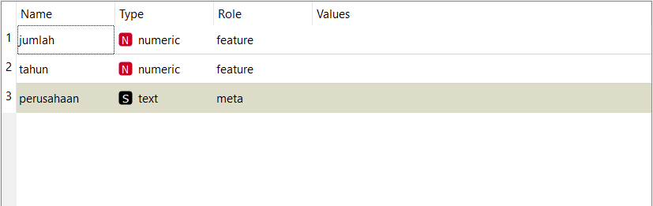
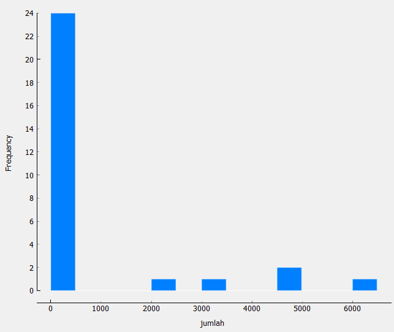
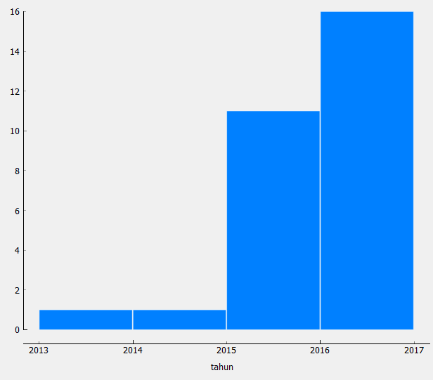

# Tugas 1 Data Mining

## JUMLAH PENGGUNA LAYANAN PEMUTARAN FILM DAN STORY TELLING

NAMA : MUHAMMAD ALFAN CHOLILI (1804400107)

## Tipe-Tipe Data

## Distribusi Data

Data Jumlah :

Data Tahun :

## RATA-RATA DAN STANDART DEVIASI

RATA-RATA : 763.448275862069

STANDART DEVIASI : 1718.776

